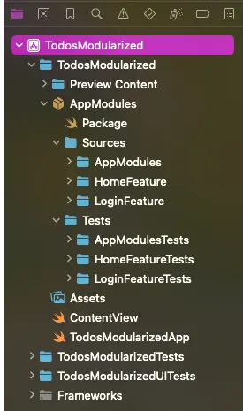
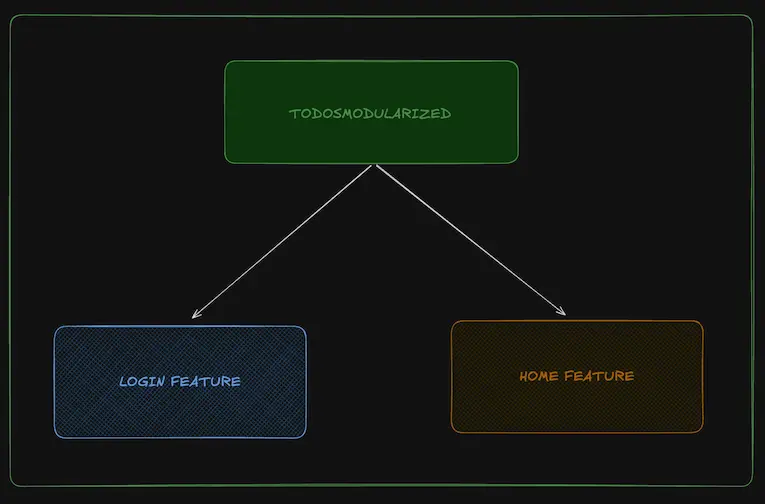
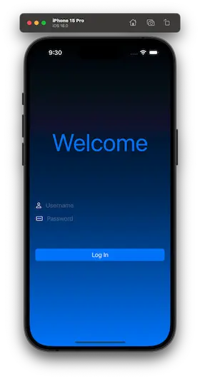
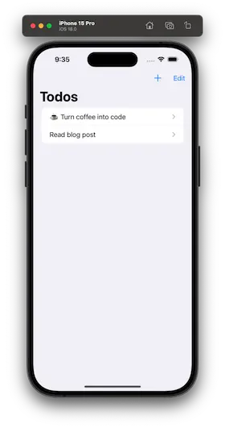

# Todos sample app - Modularized

Companion app for blog post: [How to start your modular iOS architecture](https://mikegb.dev/posts/how-to-start-your-modular-ios-architecture)

Requirements:
- Xcode 16 beta 6 or newer

## Project structure

## Architecture Diagram

App functionality:
## 1. Login View

## 2. Home View

